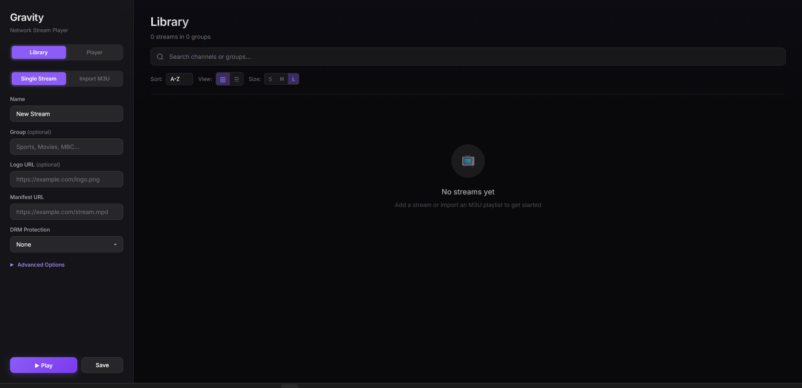
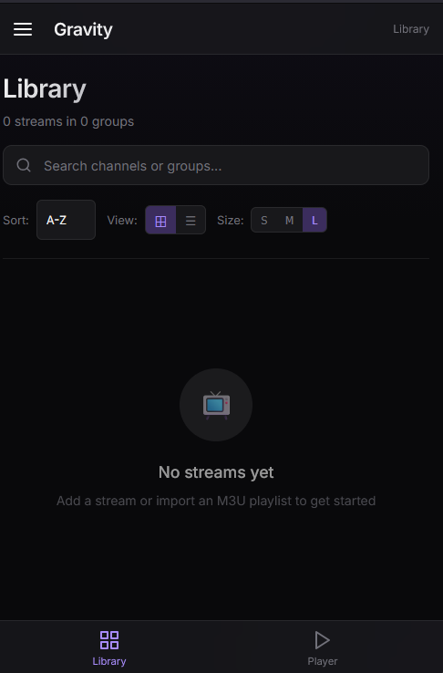
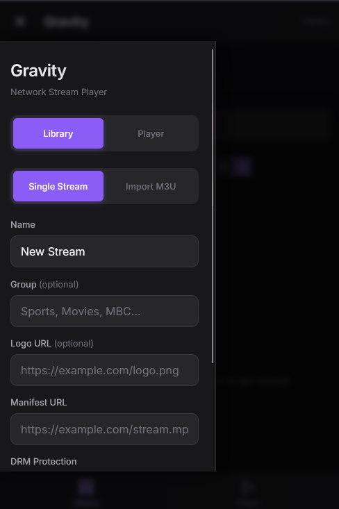

# Gravity

A modern, feature-rich network stream player built with React and Shaka Player. Gravity provides a sleek interface for managing and playing IPTV streams, HLS, DASH, and DRM-protected content directly in your browser.

[](https://gravityiptv.netlify.app/)
[](LICENSE)

---

## Screenshots

### Desktop


### Mobile
| Library View | Sidebar Drawer |
|:---:|:---:|
|  |  |

---

## Features

- **Multi-Format Support** - Play HLS, DASH, and smooth streaming content
- **DRM Playback** - Widevine and ClearKey decryption support
- **M3U Import** - Bulk import channels from M3U/M3U8 playlist files
- **Channel Library** - Organize streams with custom groups and logos
- **Persistent Storage** - Library and preferences saved locally
- **Search and Filter** - Quickly find channels across your library
- **Multiple View Modes** - Grid and list layouts with adjustable sizing
- **Custom Headers** - Set User-Agent, Referrer, and Authorization headers
- **Responsive Design** - Optimized for desktop and tablet displays

---

## Live Demo

Experience Gravity without installation:

**[https://gravityiptv.netlify.app/](https://gravityiptv.netlify.app/)**

---

## Getting Started

### Prerequisites

- Node.js 18+
- npm or yarn

### Installation

1. Clone the repository:

```bash
git clone https://github.com/fairy-root/gravity.git
cd gravity
```

2. Install dependencies:

```bash
npm install
```

3. Start the development server:

```bash
npm run dev
```

4. Open your browser and navigate to `http://localhost:5173`

### Production Build

```bash
npm run build
```

The optimized build will be generated in the `dist` directory.

---

## Usage

### Playing a Stream

1. Enter the stream URL in the sidebar configuration panel
2. Optionally configure DRM settings if the stream is protected
3. Click **Play** to start playback

### Importing M3U Playlists

1. Click the **Import M3U** button in the sidebar
2. Select your `.m3u` or `.m3u8` file
3. Channels will be automatically parsed and added to your library

### DRM Configuration

For DRM-protected streams:

- **ClearKey** - Enter key pairs in `keyId:key` format (comma-separated for multiple)
- **Widevine** - Provide the license server URL

### Custom Headers

Configure request headers for streams that require authentication:

- **User-Agent** - Custom browser identification
- **Referrer** - Origin URL for hotlink protection
- **Authorization** - Bearer token or API key

---

## Technology Stack

| Component | Technology |
|-----------|------------|
| Framework | React 19 |
| Build Tool | Vite 7 |
| Player Engine | Shaka Player 4.x |
| Styling | Vanilla CSS |
| Storage | localStorage |

---

## Project Structure

```
gravity/
├── public/
├── src/
│   ├── components/
│   │   ├── Player.jsx
│   │   ├── StreamConfig.jsx
│   │   ├── Library.jsx
│   │   └── ConfirmModal.jsx
│   ├── utils/
│   │   └── m3uParser.js
│   ├── App.jsx
│   ├── main.jsx
│   └── index.css
├── index.html
├── package.json
└── vite.config.js
```

---

## Contributing

Contributions are welcome. Please follow these steps:

1. Fork the repository
2. Create a feature branch (`git checkout -b feature/new-feature`)
3. Commit your changes (`git commit -m 'Add new feature'`)
4. Push to the branch (`git push origin feature/new-feature`)
5. Open a Pull Request

---

## Donation

Your support is appreciated:

- **USDt (TRC20)**: `TGCVbSSJbwL5nyXqMuKY839LJ5q5ygn2uS`
- **BTC**: `13GS1ixn2uQAmFQkte6qA5p1MQtMXre6MT`
- **ETH (ERC20)**: `0xdbc7a7dafbb333773a5866ccf7a74da15ee654cc`
- **LTC**: `Ldb6SDxUMEdYQQfRhSA3zi4dCUtfUdsPou`

---

## Author

- **GitHub**: [FairyRoot](https://github.com/fairy-root)
- **Telegram**: [@FairyRoot](https://t.me/FairyRootDev)

---

## License

This project is licensed under the MIT License. See the [LICENSE](LICENSE) file for details.
