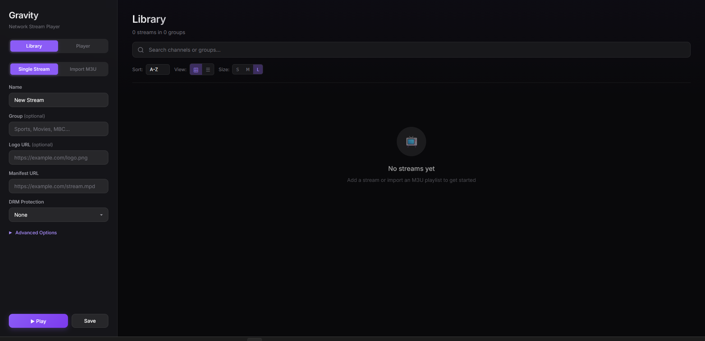
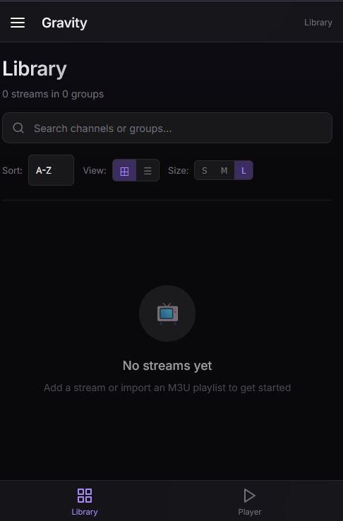
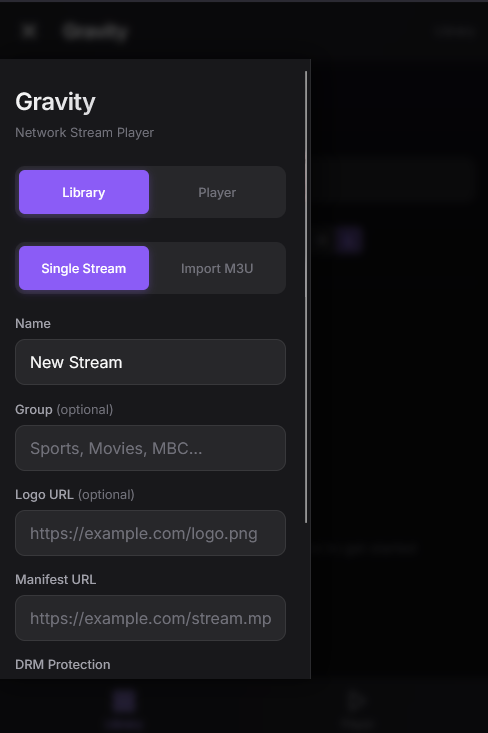

# Gravity

A dark-themed browser app for playing DASH/HLS network streams with DRM support. Built with **React**, **Vite**, and **Shaka Player**.

## Demo Preview

**https://gravityiptv.netlify.app/**

## Screenshots

### Desktop

Library view with sidebar stream form (single stream / M3U import), search, and grid controls.



### Mobile

Responsive library with bottom navigation between Library and Player.



### Mobile drawer

Hamburger menu opens the configuration drawer (Library / Player, stream form).



## Features

### Playback
- DASH (`.mpd`) and HLS (`.m3u8`) streams
- **ClearKey**, Widevine, and PlayReady DRM
- Persistent Shaka player instance (smooth channel switching)
- Live-stream friendly buffering and retry
- Aspect ratio modes in the control bar: **Fill Width**, **Fill**, **Original**
- Quality, language, playback rate, captions (overflow menu)
- Double-click fullscreen

### Library
- Import M3U playlists (file upload or paste)
- Groups with expand / collapse
- Grid or list view, search, sort
- Edit channels
- Delete **one channel**, a **whole group** (with confirmation), or **clear all**
- Export library back to M3U
- Saved in browser `localStorage`

### M3U / DRM
Parses Kodi-style properties:

```m3u
#EXTM3U
#EXTINF:-1 tvg-name="Channel" tvg-logo="https://..." group-title="Group",Channel Name
#KODIPROP:inputstream.adaptive.license_type=clearkey
#KODIPROP:inputstream.adaptive.license_key=keyId:key
https://stream.example.com/index.mpd
```

Also supports:
- `#EXTVLCOPT:http-user-agent=...` / `#EXTVLCOPT:http-referrer=...`
- `#EXTHTTP:{"User-Agent":"..."}`
- ClearKey as `kid:key` or `kid:key,kid2:key2` (UUID dashes allowed)

## Requirements

- **Node.js** 18+ (20 LTS recommended)
- npm

## Quick start

```bash
npm install
npm run dev
```

Open [http://localhost:5173](http://localhost:5173).

### Scripts

| Command           | Description              |
|-------------------|--------------------------|
| `npm run dev`     | Dev server with HMR      |
| `npm run build`   | Production build → `dist/` |
| `npm run preview` | Preview production build |
| `npm run lint`    | ESLint                   |

## Usage

1. **Import** an M3U playlist from the sidebar (**Import M3U**), or add a single stream.
2. Open the **Library** tab and press **Play** on a channel.
3. Use player controls for volume, aspect ratio, fullscreen, and more.
4. **Delete** a channel from its card, a **group** from the group header, or **Clear All** from the library toolbar (all with confirmation).

### ClearKey

In the form or M3U:

```text
keyId:key
```

Hex only (32 characters each). Multiple keys: `kid1:key1,kid2:key2`.

### Advanced headers

Optional User-Agent, Referrer, and Authorization. Browsers block some header names (e.g. User-Agent); CORS on the stream CDN must allow the origin.

## Project layout

```text
src/
  App.jsx                 # App shell, library state, confirmations
  components/
    Player.jsx            # Shaka player lifecycle
    aspectRatioControl.js # Custom Shaka aspect-ratio control
    Library.jsx           # Library UI
    StreamConfig.jsx      # Sidebar form + M3U import
    ConfirmModal.jsx      # Delete confirmations
  utils/
    m3uParser.js          # M3U + KODIPROP parsing
    m3uGenerator.js       # Library → M3U export
    drm.js                # ClearKey / DRM helpers
  index.css               # Theme + player styles
```

## Hosting

### Netlify (recommended)

This repo includes `netlify.toml` and an **edge stream proxy**. Some CDNs return **HTTP 403** when the browser sends `Origin: https://your-site.netlify.app` (while `localhost` still works). The proxy loads manifests/segments from Netlify’s edge so the CDN never sees that Origin.

| Setting            | Value            |
|--------------------|------------------|
| Build command      | `npm run build`  |
| Publish directory  | `dist`           |

Deploy by connecting the GitHub repo to Netlify (or `netlify deploy --prod`). Ensure edge functions are enabled (default on Netlify).

**How the proxy works**

- Hosted builds rewrite stream URLs to `/api/proxy/https/cdn-host/path...`
- Localhost does **not** use the proxy (CDN usually allows it; saves bandwidth)
- Force proxy in dev: set `VITE_FORCE_PROXY=true`

**Note:** Live video bandwidth flows through Netlify’s edge. Free-tier limits may apply on heavy use.

### Other hosts (Vercel, Cloudflare, etc.)

You need an equivalent reverse proxy for blocked Origins; a static-only deploy will keep getting 403 from those CDNs. For GitHub Pages, set Vite `base` to your repo path in `vite.config.js` (proxy not available there).

## Compatibility notes

| Feature            | Status | Notes                                      |
|--------------------|--------|--------------------------------------------|
| DASH / HLS         | ✅     | Via Shaka Player                           |
| ClearKey           | ✅     | Works in modern browsers                   |
| Widevine           | ⚠️     | Needs HTTPS + license server               |
| PlayReady          | ⚠️     | Limited browser support                    |
| Custom headers     | ⚠️     | Some headers forbidden by the browser      |
| Cross-origin streams | ⚠️   | Use Netlify proxy when CDN blocks Origin   |

## License

MIT
